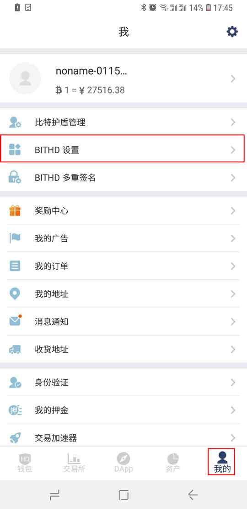
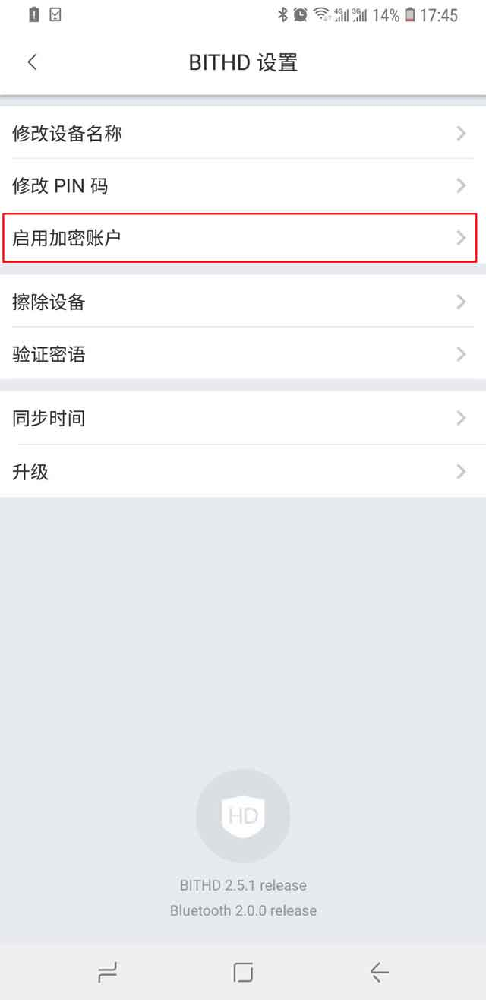
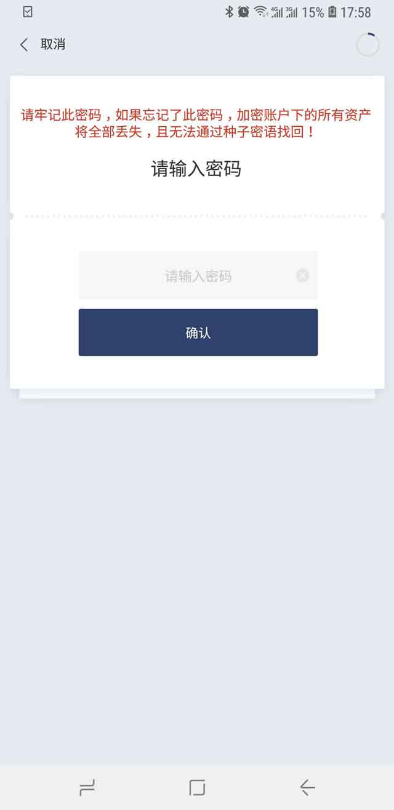

BITHD 密码账户
================

比特护盾密码账户是比特护盾的可选功能，建议密码保管能力较强的人使用。

启用加密账户后的好处：

1.拥有双重保护，发币等相关资产操作需要双重验证，PIN码 + 加密账户密码。

2.存储在加密账户中的资产，即使12个种子泄露，也依然无需担心，黑客在没有密码情况下是无法获取您加密账户的资产的。

提示：

请牢记此密码，如果忘记此密码，加密账户下的所有资产将全部丢失，且无法通过种子密语找回。

操作方法：

1.更新比特派版本至3.8.3。

2.打开我的菜单，BITHD 设置，启用加密账户。

3、输入PIN 码之后，出现密码账户的页面。

