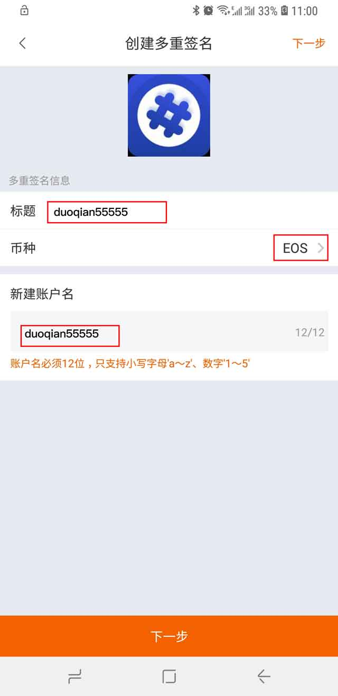
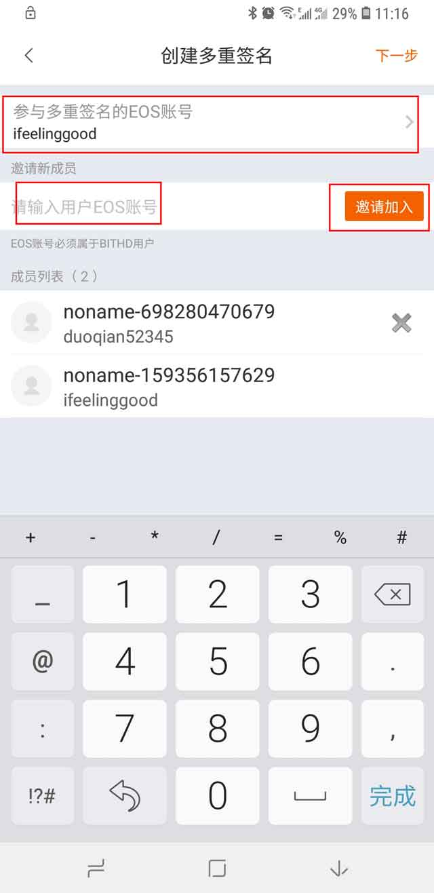
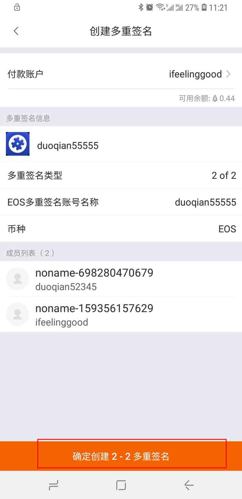
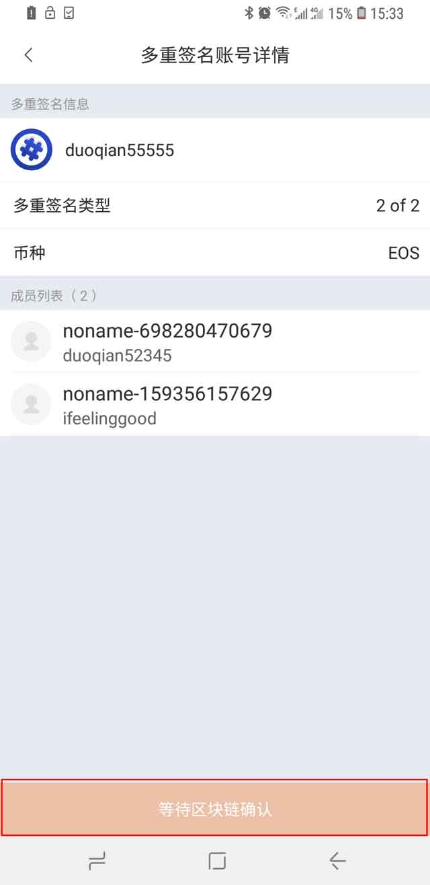
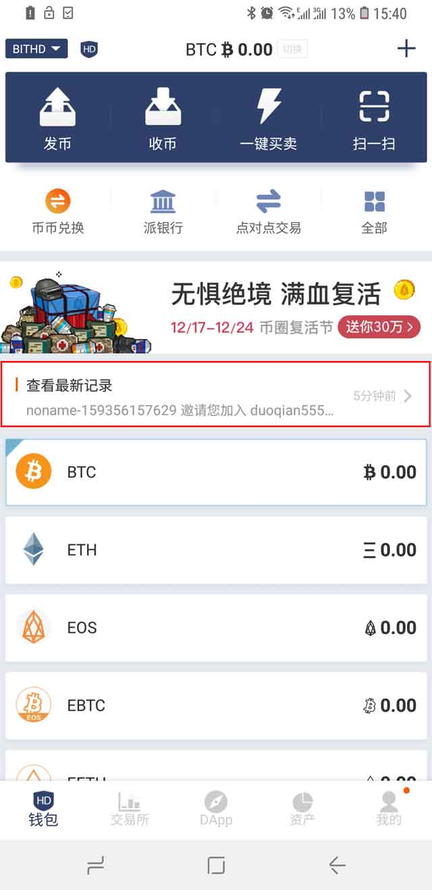
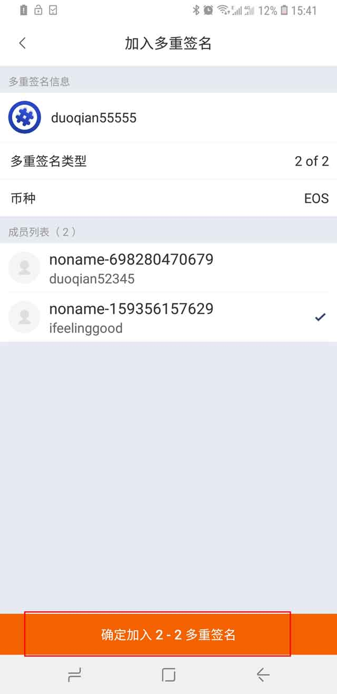

EOS 多重签名
===============================

本教程创建 2 - 2 多重签名为例：

准备工作
----------------------------------------

1､ 准备两台比特护盾（两台比特护盾都需要有 EOS 账户）。

2、比特派版本升级至 3.8.2 。

3、比特护盾固件升级至 V2.5.1 （比特护盾屏幕显示 B: v2.0.4 F: v2.5.1）。

4、如果您的比特护盾已经有 EOS 账户就不用创建 EOS 账户，确保对应的 EOS 账户有足够的（CPU, RAM, NET）资源即可。如果您没有 EOS 账户，需创建 EOS 账户，切换至 EOS 币种，选择账户管理，选择创建账户，目前比特护盾支持三种方式创建 EOS 账户（使用支付宝/银行卡创建、使用派钱包余额创建、请朋友使用 Bitpie 扫一扫创建），建议您使用 " 请朋友使用 Bitpie 扫一扫创建  "这种方式，简单方便，然后给创建好的 EOS 账户质押足够的资源（CPU, NET, RAM），比如给 CPU 资源 10 个 EOS（建议质押10个，也可以根据自已的实际使用情况进行质押，以免操作的时候提示 CPU 资源不足）。

创建 EOS 多重签名账户
------------------------------------

1、选择我的菜单，选择 BITHD 多重签名，选择右上角 "+" 号进行创建，选择头标，输入标题，选择 EOS 币种，输入 新建账户名，选择下一步。

2、在创建多重签名页面。选择参与多重签的 EOS 账号，输入邀请新成员 EOS 账户（注：邀请的 EOS 账号必须属于 BITHD 用户），选择下一步。

3、弹出签名数量信息。选择确认。

4、确定创建 2 - 2 多重签名页面，确认信息是否有误，选择 " 确定创建 2 - 2 多重签名 " ，输入比特所盾 PIN 码，进行确认签名。

比特护盾屏幕上会出现以下信息：

"Confirm creating account:duoqian55555"，按手表上的确认键。

"Confirm owner weight:2 throshold:2"， 按手表上的确认键。

"Owner accounts #01:duoqian52345 permission:active weight:1"， 按手表上的确认键。

"Owner accounts #02:ifeelinggood permission:active weight:1"，按手表上的确认键。

"Confirm active weight:2 throshold:2"，按手表上的确认键。

"Active accounts #01:duoqian52345 permission:active weight:1"，按手表上的确认键。

"Active accounts #02:ifeelinggood permission:active weight:1"，按手表上的确认键。

"Really create account:duoqian55555"，按手表上的确认键。

"Confirm placing 0.1000 EOS in exchange for NET,0.5000 eos in exchange for CPU"，按手表上的确认键。

"Do you want transfer these to duoqian55555"，按手表上的确认键。

"Really plage 0.6000 EOS for resources to duoqian55555"，按手表上的确认键。

"Really plage 0.6000 EOS for resources pay account ifeelinggood"，按手表上的确认键。

"Confirm buying 4096 bytes ram for account:douqian55555"，按手表上的确认键。

"Really buy 4096 bytes ram,Pay account:ifeelinggood"，按手表上的确认键。

5、签名完成之后，耐心等待 EOS 区块确认，待确认之后，被邀请者在最新的记录中会有一条加入多重签名的信息。

被邀请者加入 2 - 2 多重签名
-----------------------------------

1､查看最新的记录，有加入多重签名的信息，点击进入。

2､进入加入多重签名页面，点击确认加入 2 - 2 多重签名。输入 PIN 码。比特护盾屏幕显示 "bitid://mulltisig/join/password/*****" 相关信息，按手表上的确认键。

多重签名地址收币
---------------------------------

进入我的菜单，选择 BITHD 多重签名，选择刚刚创建好的多重签名 "douqian55555"，选择收币。

多重签名地址发币
----------------------------------

备注：在进行发币前，先为多重签名 EOS 账户质押足够的资源，比如给 EOS 多重签名账户的 CPU 资源质押 10 个 EOS（建议质押10个，也可以根据自己的实际情况进行质押，以免发币的时候提示资源不足）。

1、进入我的菜单，选择 BITHD 多重签名，选择刚刚创建好的多重签名 "douqian55555"，选择发币。

2、输入地址及金额之后，确认无误，点击发送。输入 PIN 码进行签名交易。

在比特护盾屏幕会显示

"Confirm creating proposal name: transfer proposer:duoqian52345" ，按手表上的确认键。
"Confirm sending 0.3000 EOS to ***"，按手表上的确认键。
"Really send 0.3 EOS Pay duoqiang55555"，按手表上的确认键。
"Really create proposal name:transfer proposer:duoqian52345"，按手表上的确认键。

3、进入交易详情页面，选择同意。

在比特护盾屏幕会显示

"Confirm approve proposal name: transfer proposer:duoqian52345"，按手表上的确认键。

"Really approve proposal name:transfer approver:duoquan52345"，按手表上的确认键。

4､加入多重签名的另外一个账户也需要进行同意。在另外一台护盾中，最新记录中会出现一条多重签名交易，打开。

5､在交易详情页面中选择同意。输入 PIN 码。签名之后完成之后，确定发送即可。