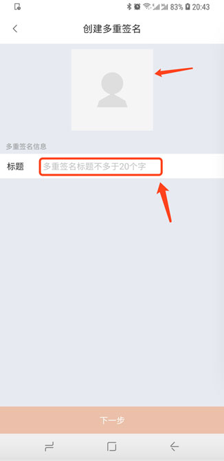
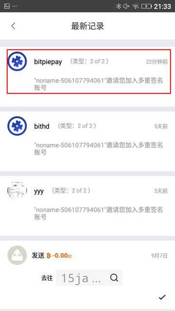

BITHD 多重签名
=====================================

目前支持币种：BTC、ETH、EOS

说明：比特派的版本号大于 3.7.8，具体多人管理资产的功能，在发币时是需要多重签名操作的。

创建多重签名账号
---------------

邀请方操作：

1、切换到 BITHD 账户，选择 BITHD 多重签名，右上角 "+" 号，在创建多重签名页面，选择适合自己的图标以及标题。

2、邀请新成员，输入需要多重签名的 UID，此 UID 必须是 BITHD 的 UID(在我的菜单，头像一栏可查看)，点击邀请加入，选择下一步。

3、确认签名数量，选择确认。

4、再次确认多重签名。

5、输入 BITHD PIN 码。

6、创建多重签名手表确认。手表确认之后就会提示创建成功。

被邀请方操作：

1、切换到邀请的账号下，选择查看最新记录。就会有对应的多重签名信息，进入加入多重签名页面。

2、输入 BITHD PIN 码。

3、BITHD 手表确认。

