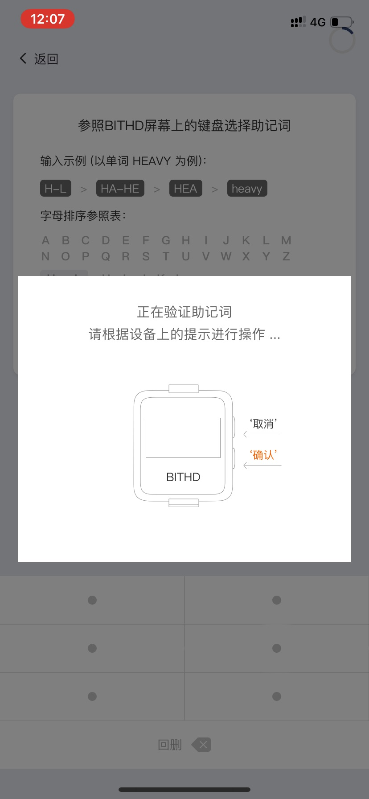

如果我的 BITHD，PIN码或者种子丢失了怎么办？
============================================

BITHD钱包
------------------------

如果您的 BITHD 钱包丢失，被盗或者坏掉了，您随时可以在另一个**BITHD 钱包或任何兼容BIP39规范的钱包中恢复**，**前提是您一定抄写好了您的 12 个助记词**。

12 个助记词特别重要，他们决定着您是数字货币的所有者。永远不要泄露、永远不要遗失。

如果您 PIN 码忘记了
-----------------------------

**一但您的 PIN 码忘记，BITHD 将进入锁定状态，您的BITHD将无法使用但您的资产依旧由助记词掌管，不受影响。当前版本不支持解锁，我们将在后续版本提供相关解锁功能。请保管好您的12个助记词，助记词是您掌控资产的唯一方式。助记词遗失，资产将无法恢复。**

如果你的种子卡丢失了
------------------------

您抄写种子的种子卡非常重要，您必须要将其放在非常安全的位置，妥善保管！

如果您丢失了种子卡，则需要立即将您的全部余额转移到临时钱包。然后用 BITHD 创建一个新的种子。完成后，将余额转回到您的账户钱包。

BITHD 助记词恢复
------------------------

1、打开比特派 App。在我 - 比特护盾管理 - 找到您的 BITHD 设备。

2、在初始化页面中，选择 "恢复旧钱包"。

3､ 进入 "欢迎来到 BITHD "页面中为 BITHD 命名。

4、开始进行恢复助记词，首先设置 PIN 码。手机键盘上的点位对应 BITHD 屏上的数字，输入完之后再点确认。进入 请确认 PIN 码页面，再次输入上一次的 PIN 码。

5、进入"参照BITHD屏幕上的键盘选择助记词"。选择需要在 BITHD 设备上恢复的助记词。

Please enter the 1st word of your mnemonic（请输入您抄写种子的第1个助记词）；

一、以单词“HEAVY”为例

a.首先在硬件端找到首字母"H"的位置，在手机键盘的对应位置点击

b.此时硬件端屏幕将会进入第二个字母"E"的选择页面，找到"HE"所在键位

c.此时设备屏幕会进入到第三个字母的选择界面，找到我们需要的"HEA"的位置

d.此时设备屏幕已经定位到了我们想要输入的"HEAVY"单词的位置，记住它的键位，点击"HEAVY"所对应的位置即可

5、输入完之后，APP 会提示您 "正在恢复账号，请根据设备上的提示进行操作.."。在比特护盾上按一下确认键即可。

.. image:: ../img/seed_recovery.jpg
    :width: 250px
    :height: 500px
    :scale: 100%
    :align: center

备注：比特护盾在恢复过程中不要停顿，请根据提示输入。

BITHD 验证助记词
------------------------------

1、通过 Bitpie APP 连接比特护盾(BITHD)。

2、我的 - BITHD 设置 - 验证助记词（验证助记词的过程中不要超时，请根据比特护盾上的提示进行输入）。

3、输入 PIN 码。

4、在种子验证界面过程中比特护盾手表中会提示以下语句

Please enter the 1st word of your mnemonic（请输入您抄写种子的第1个助记词）；

一、以单词“HEAVY”为例

a.首先在硬件端找到首字母“H”的位置，在手机键盘的对应位置点击

b.此时硬件端屏幕将会进入第二个字母"E"的选择页面，找到"HE"所在键位

c.此时设备屏幕会进入到第三个字母的选择界面，找到我们需要的"HEA"的位置

d.此时设备屏幕已经定位到了我们想要输入的"HEAVY"单词的位置，记住它的键位，点击"HEAVY"所对应的位置即可

5、输入完之后，APP 会提示您 "正在验证助记词，请根据设备上的提示进行操作.."。在比特护盾上按一下确认键即可。

