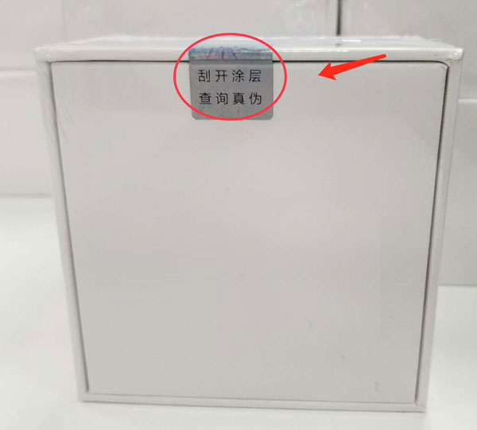

比特护盾防伪码
=====================================

为了防止您拿到假冒伪劣商品或二手比特护盾(BITHD) ，保护您的资产安全，比特派提供防伪码检验功能。

请先进行检验，然后再使用比特护盾 (BITHD)。

1、检验 比特护盾 BITHD，刮开图导，查询真伪。

2、打开比特派 - 设置 - BITHD 防伪码 - 选择二维码扫描（对准包装上的二维码进行扫描）。

.. image:: ../img/1_2.jpg
    :width: 250px
    :height: 420px
    :scale: 100%
    :align: center

