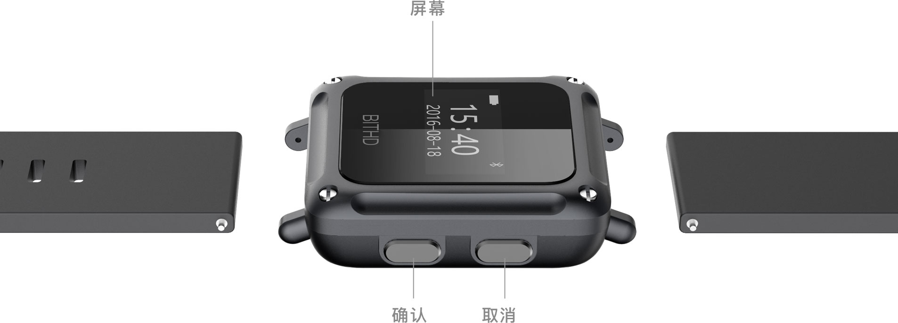
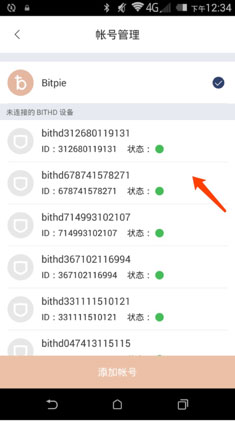
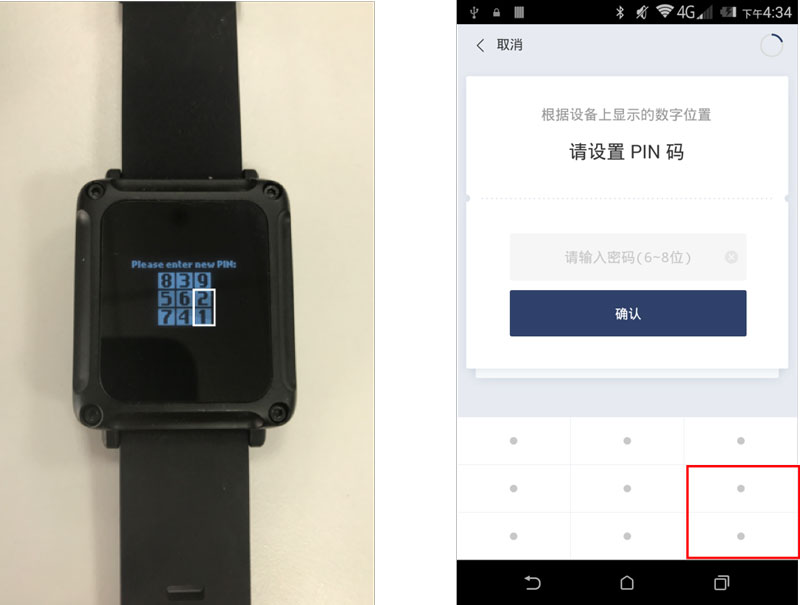
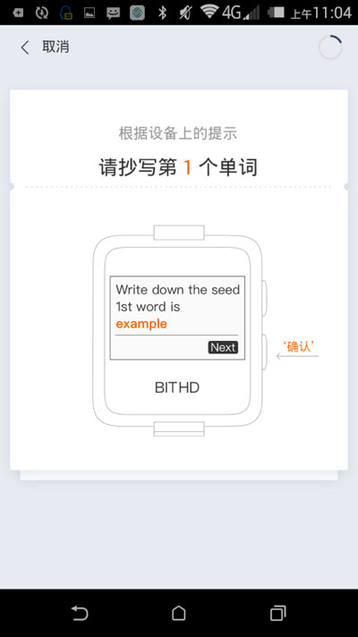

如何开始使用我的 BITHD
=====================================

外观
---------------

你的 BITHD 包括一个OLED屏幕，2个按钮，支持USB2.0充电。

​2个按钮用于用户指导：

下面按键为“确认”键，上面按键为“取消“键

如您所见，手表没有任何电源按键。任意按键按下1次，显示账户余额；按键按下2次，显示 BITHD 序列号信息；按键按下3次，即显示主屏幕时间信息。

连接您的设备
---------------------

1、保证您的  **bitpie 版本在v3.0.7 以上**。在 bitpie 我 — 账号管理页面。

2、根据设备号（手表任意按键按下2次，显示 BITHD 序列号信息），页面上选择您要连接的设备，进行配对。

3、BITHD 端会有配对码显示，在 bitpie 端输入进行配对，配对成功后开始初始化设备，接下来就可以创建 BITHD 账户了。

创建我的 BITHD 账号
-----------------------------------

1、首次进入钱包给新钱包命名（设备标签）。

2、名字输入完成后，设置钱包的 6-8位 PIN 码，**bitpie 九宫格输入对应 BITHD 钱包显示的数字**，需要签名相关操作就需要输入PIN码。

   ​

以上标注的为 PIN 码输入规则，根据手表上显示的PIN码位置，在 bitpie APP 内对应位置输入。

3､ PIN码设置好后，拿出你的种子卡，开始抄写你的种子！一定要认认真抄写您的 12 个种子密语。

4、BITHD 账号创建完成，您可以在比特派应用内自由切换您的BITHD和 bitpie 账号啦。
