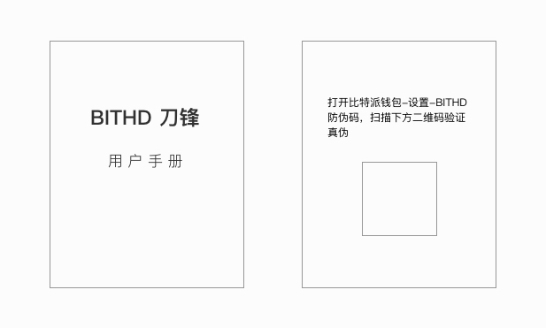
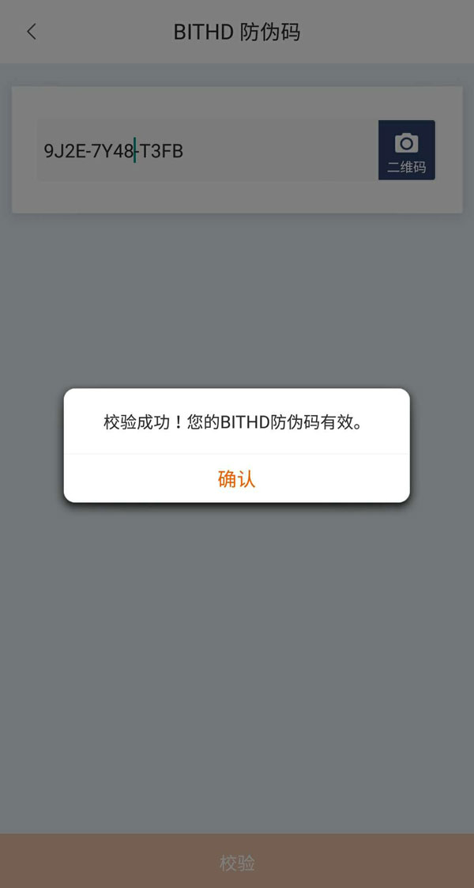

刀锋防伪码
=====================================

为了防止您拿到假冒伪劣商品或二手刀锋(RAZOR) ，保护您的资产安全，比特派提供防伪码检验功能。

请先进行检验，然后再使用刀锋 (RAZOR)。

1、检验刀锋RAZOR，打开用户手册最后一页二维码，查询真伪。

2、打开比特派 - 我 - 设置 - BITHD 防伪码 - 选择二维码扫描（用户手册最后一页的二维码进行扫描）。

