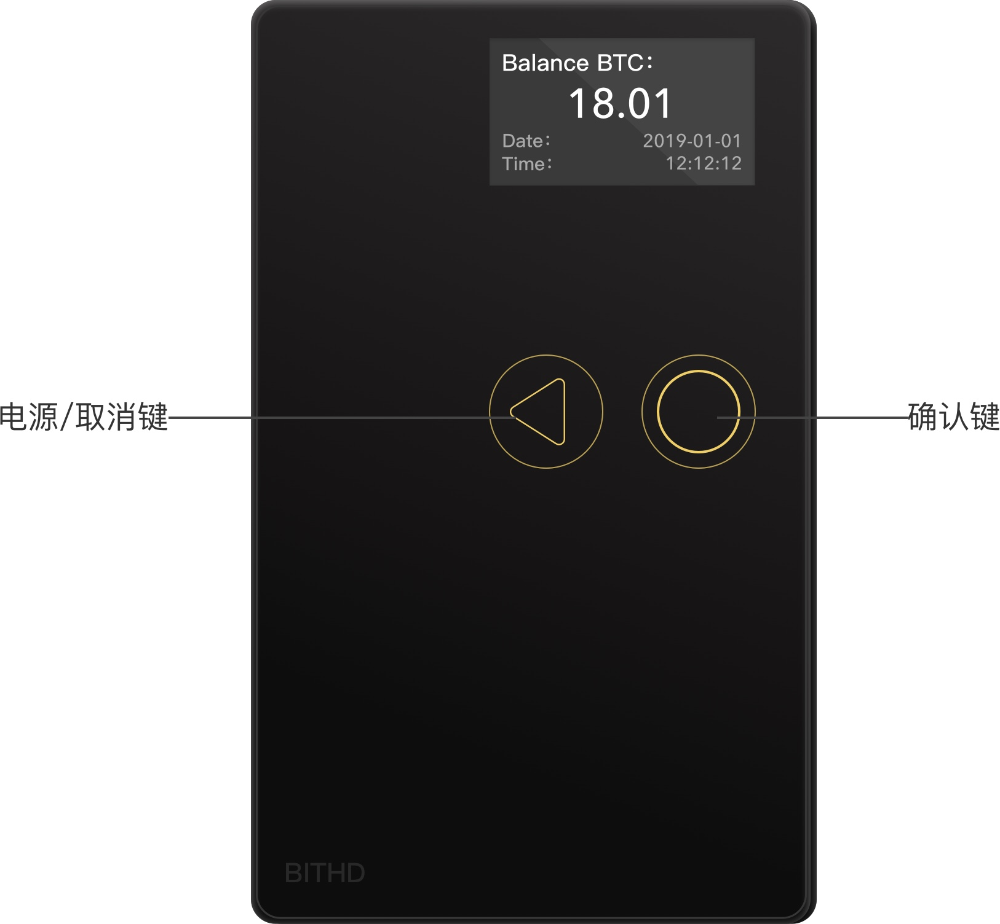
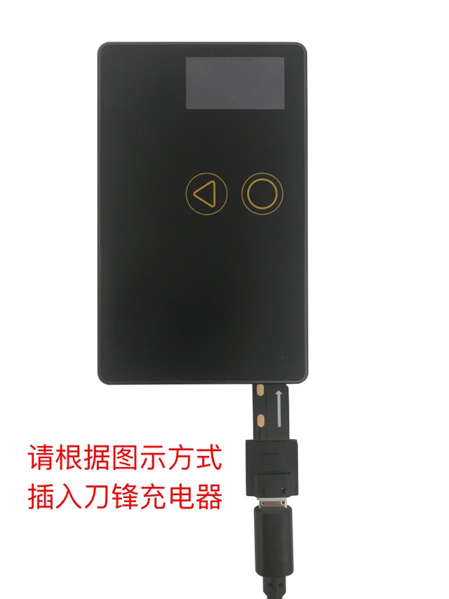
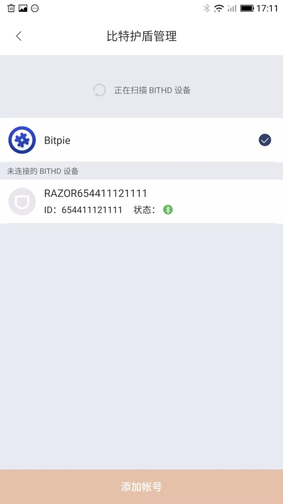
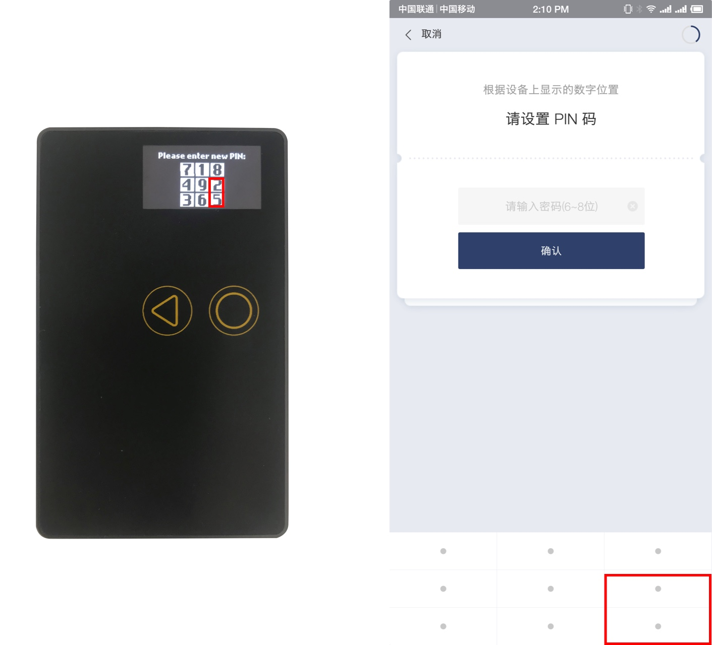
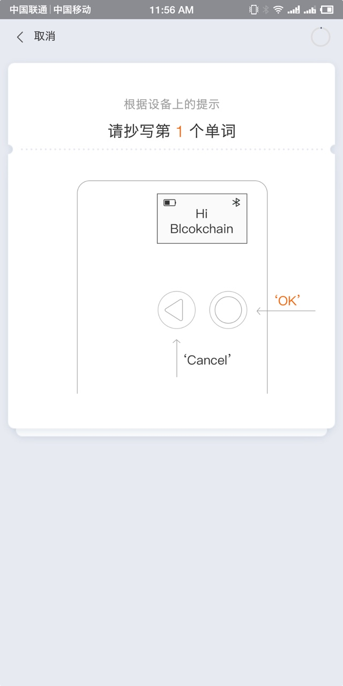

如何开始使用我的刀锋
=====================================

支持币种
---------------

目前刀锋支持 BTC、ETH、USDT、EOS、BCH、BSV、ETH/Token(ERC20)、EOS Token、LTC、DASH、ZEC、DOGE

外观
---------------

你的刀锋包括一个OLED屏幕，2个按钮，支持USB2.0充电。

​2个按钮用于用户指导：

左侧按键为“取消/电源”键，右侧按键为“确认“键

电源/取消键：电源开关，长按1.5S开机或关机；短按-取消、返回等功能。任意按键按下1次，显示账户余额；按键按下2次，显示刀锋序列号信息；按键按下3次，即显示主屏幕信息。

请根据图示对刀锋进行充电，注意标有箭头侧向上

连接您的设备
---------------------

1、保证您的  **bitpie 版本在v4.0.4 以上**。在 bitpie 我 — 账号管理页面。

2、根据设备号（刀锋任意按键按下2次，显示刀锋序列号信息），页面上选择您要连接的设备，进行配对。

3、刀锋会有配对码显示，在 bitpie 钱包输入进行配对，配对成功后开始初始化设备，接下来就可以创建刀锋账户了。

创建我的刀锋账号
-----------------------------------

1、首次进入钱包给新钱包命名（设备标签）。

2、名字输入完成后，设置钱包的 6-8位 PIN 码，**bitpie 九宫格输入对应刀锋钱包显示的数字**，**请记好您设置的PIN码，PIN忘记后不可找回**，需要签名相关操作就需要输入PIN码。

   ​

以上标注的为 PIN 码输入规则，根据手表上显示的 PIN 码位置，在 bitpie 钱包内对应位置输入。

3､ PIN 码设置好后，拿出你的种子卡，开始抄写你的助记词！一定要认认真抄写您的 12 个助记词。

4、刀锋账号创建完成，您可以在比特派应用内自由切换您的刀锋和 bitpie 账号啦。
