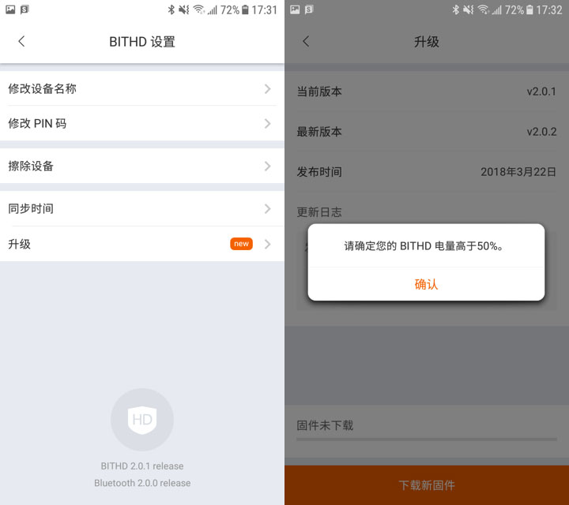
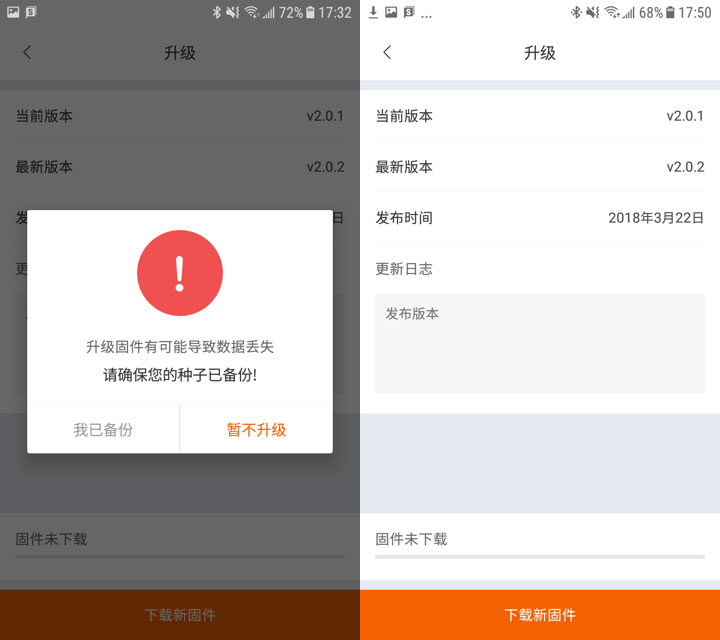

如何进行固件升级，注意事项有哪些
=========================================

体验新版功能进行固件升级是必不可少的一步，如果在固件升级操作不当，可能会造成数据丢失，所以**一定要在抄写好助记词的情况下进行此操作**。

固件升级
-------------------------

1、在手机电量高于50%时进行固件升级，避免在升级过程中手机电量过低，造成升级中断。

2、固件升级可能会造成数据丢失，一定要确保您已经备份好了您的助记词！

3. 固件升级过程中注意事项（很重要）
   - 不要退出升级界面
   - 不要切到后台运行，也就是不要点到其他应用中，不要返回到主屏幕
   - 不要断开蓝牙连接

