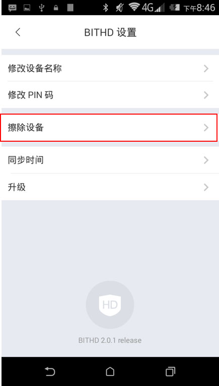

如果我的 BITHD，PIN码或者种子丢失了怎么办？
============================================

BITHD钱包
------------------------

如果您的 BITHD 钱包丢失，被盗或者坏掉了，您随时可以在另一个**BITHD 钱包或任何兼容BIP39规范的钱包中恢复**，**前提是您一定抄写好了您的 12 个种子密语**。

12 个种子密语特别重要，他们决定着您是数字货币的所有者。永远不要泄露、永远不要遗失。

如果您PIN码忘记了
-----------------------------

**保证您已经抄写好了12个种子密语，再进行以下操作。**先连接 BITHD，选择擦除设备，重新恢复账户即可。

如果你的种子卡丢失了
------------------------

您抄写种子的种子卡非常重要，您必须要将其放在非常安全的位置，妥善保管！

如果您丢失了种子卡，则需要立即将您的全部余额转移到临时钱包。然后用 BITHD 创建一个新的种子。完成后，将余额转回到您的账户钱包。