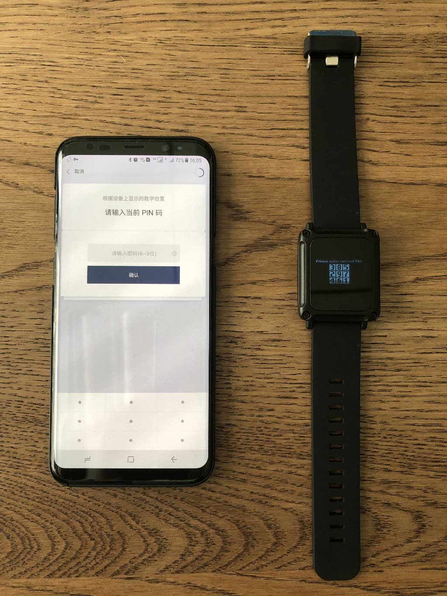
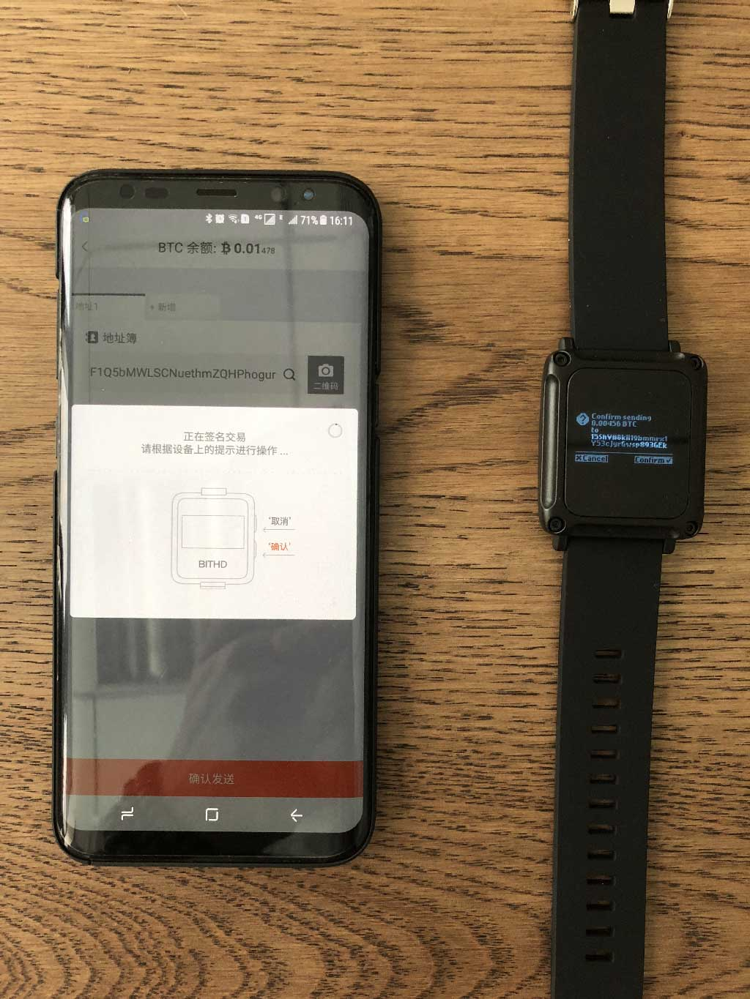
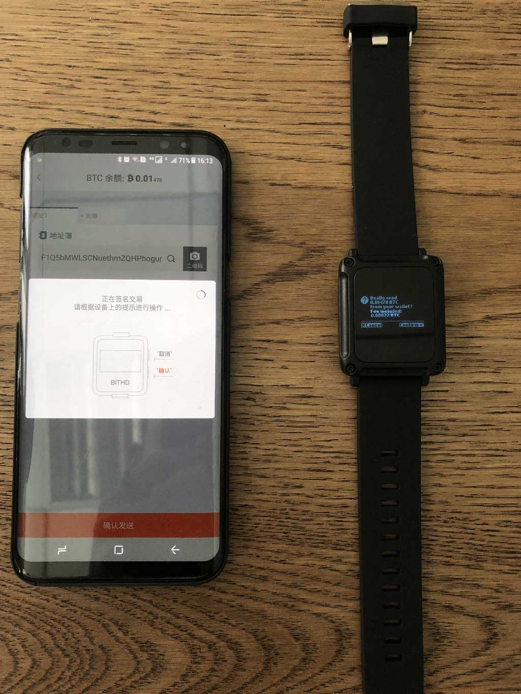

发币收币
============================================

比特护盾现支持BTC、ETH、ETH下ERC20所有代币。下面以 BTC 收币、发币为例，切换到 BITHD 账户下的 BTC 页面。

注：在进行收币前请确保您是否抄写好种子密语。

BTC 收币
------------------------

在 BITHD 钱包首页选择 BTC - 选择收币 - 进入我的 BTC 地址。

BTC 发币
-----------------------

在 BITHD 钱包首页选择 BTC - 选择发币 - 输入正确的 BTC 收币地址(本次收币12w8ZUtMWn168ysz788K62vyauMoXXNsgt)、输入 BTC 金额（本次发0.01）

点击确认发送。

.. image:: ../img/bithdsend3.jpg
    :width: 320px
    :height: 390px
    :scale: 100%
    :align: center

显示具体的矿工费、发送地址、金额信息。选择确定。

输入当前的 PIN 码信息。

第一次确认是将 0.01 BTC 发送到 12w8ZUtMWn168ysz788K62vyauMoXXNsgt
(Confirm sending 0.01 BTC to 12w8ZUtMWn168ysz788K62vyauMoXXNsgt)
(Confirm 确认，Cancel取消)

第二次确认是将 0.00456 BTC 发送到您的找零地址 15ShVH8kH19bmmrx1Y53cjyrGwsp893GEk
（Confirm sending 0.00456 BTC to 15ShVH8kH19bmmrx1Y53cjyrGwsp893GEk）

第三次确认 发送这笔交易需要矿工费 0.00022 BTC。
(Really send 0.01478 BTC from your wallet? Fee included:0.00022 BTC)
确认好之后这笔交易就完成了。

备注：以上收币地址请填写给对方发的地址哈。

